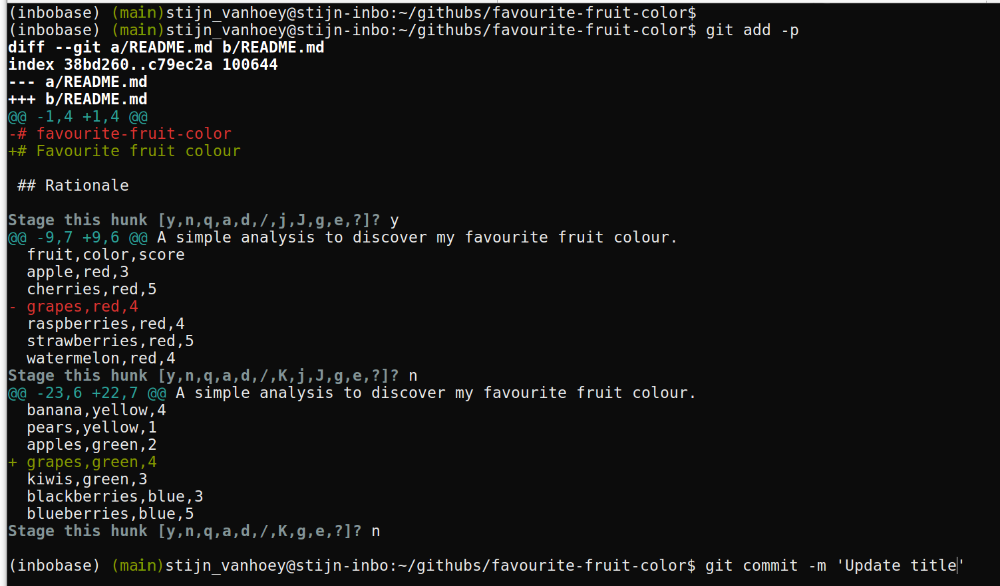

# Setup

When starting this tutorial, we assume:

* you have [Git](https://git-scm.com/) installed on your computer
* you are able to run Git from the command line

---

# Working on your own {data-background=#c2c444}

We start with you working on a repository, without interference of colleagues

---

## Create a repository

A new project starts with a new repository, which can be easily setup using [GitHub.com](https://github.com).

<div class="bs-callout bs-callout-exercise">
<h4>Exercise:</h4>
1. Go to [GitHub](https://github.com) and login
2. Follow [this tutorial](https://help.github.com/articles/create-a-repo/) to create a repo and [create your first (online) commit](https://help.github.com/articles/create-a-repo/#commit-your-first-change) to your repository
</div>

---

For this first exercise, we have chosen to create a dummy repository:


(*you do not have to copy the example, choose any name :-)*)

---

The resulting repository layout will look like this:


(*Remember that there is a `Clone or Download` button on this page!*)

---

### Installation

Just to make sure, in case you did not already installed Git:

<div class="bs-callout bs-callout-exercise">
<h4>Exercise:</h4>
1. Install [git](https://git-scm.com/book/en/v2/Getting-Started-Installing-Git)
</div>

---

### Configuration

In order to start using version control, we have to do some configuration the first time. You only leed to do this configuration once, as explained on [Configure git](https://help.github.com/articles/set-up-git/#setting-up-git).

<div class="bs-callout bs-callout-exercise">
<h4>Exercise:</h4>
1. [Set your username in Git](https://help.github.com/articles/setting-your-username-in-git).
1. [Set your commit email address in Git](https://help.github.com/articles/setting-your-commit-email-address-in-git).
1. Consider to provide authentification with [https](https://help.github.com/articles/set-up-git/#connecting-over-https-recommended) or (if you're familiar with SSH keys ) [ssh](https://help.github.com/articles/set-up-git/#connecting-over-ssh).
</div>

Use your **GitHub username**! You can check if you’re set up correctly by typing  `git config --global --list` in the same shell.

When successful, the configuration is done. Congratulations!

---

__Tip__: [adapt git configuration](https://git-scm.com/docs/git-config.html#git-config-coreeditor) to use your favourite editor

```
git config --global core.editor vim
```

---

## Clone a repo to work locally

We have initiated a repository online and a working Git installation. Hence, we can start working on the code locally by downloading the repository to our computer.

<div class="bs-callout bs-callout-exercise">
<h4>Exercise:</h4>
1. Follow [this tutorial](https://help.github.com/articles/cloning-a-repository/) to clone your repo
</div>

---

To get the https link, you need to click the green button and make sure to copy paste the link with as title `Clone with HTTPS`:

{width=75%}

---

<div class="bs-callout bs-callout-exercise">
<h4>Exercise:</h4>
In your File explorer, search for your project folder and check the content. Does this corresponds to what is shown online on your repository website?
</div>

---

### Make a commit

It is good practice to **commit often**, so you will do this a lot. Each commit should only contain changes related to a single problem/element/... Each commit is a snapshot of your project and the messages describe the story of your project.

As documentation is crucial, providing some more information in the `README.md` file will help others (and yourself in a couple of months/years) to understand the aim of the project. Just as we adapted the `README.md` file online earlier, we can do the same locally:

<div class="bs-callout bs-callout-exercise">
<h4>Exercise:</h4>
1. Open your favourite text editor
1. Update the `README.md`
1. Check the differences: use the commands `git status` and `git diff`
1. Commit your changes with `git commit`: 
    * Write commit message in editor: 
    ```
    git commit README.md
    ```
    * Write commit message inline: 
    ```
    git commit -m 'Proper commit message README.md'
    ```
</div>

---

## Push the changes to GitHub

Note that the `git status` replies *your branch is ahead of 'origin/master' by 2 commits*. This is actually providing you a warning message that there is no backup of these two commits! In order to store these changes on GitHub as well, we have to `push` our changes to GitHub:

<div class="bs-callout bs-callout-exercise">
<h4>Exercise:</h4>
1. Command `git push`: 
    ```
    git push origin master
    ```
1. Go to your repository on GitHub to verify the commits and file contents
</div>

---

Is the `README.md` adapted? Where do you find the Commits overview online?

{width=75%}

---

## Create logical commits

As mentioned earlier, you should commit often and make sure each commit links to a specific change/problem. Sometimes, this means that you have to split the additions in a single file into two individual commits. 

<div class="bs-callout bs-callout-exercise">
<h4>Exercise:</h4>
1. Make 2 unrelated changes to your `README.md` locally
1. Create one commit for each change using the `-p` (patch*) option when staging the changes:
    ```
    git add -p README.md
    ```
1. Do not push (yet)!
</div>

*check the [Git documentation](https://git-scm.com/book/en/v2/Git-Tools-Interactive-Staging#_staging_patches) for more information on interactive staging

---

### Create logical commits

{width=75%}

---

### Create a conflict

Sometimes, conflicts will appear. Maybe because a collaborator was working on exactly the same lines of code or because of a mistake in your workflow,... No worries, we'll learn you how to fix conflicts by initiating one.

<div class="bs-callout bs-callout-exercise">
<h4>Exercise:</h4>
Update your `README.md` online on GitHub, on the exact same line you just edited locally in the previous exercise.
</div>

---

If you do not remember how to change files online, check again [this online tutorial](https://help.github.com/articles/create-a-repo/#commit-your-first-change). Check the result of your online commit, similar to:

{width=75%}

---

### Conflict!

<div class="bs-callout bs-callout-exercise">
<h4>Exercise:</h4>
1. try to push (click `git push origin master`) your local changes to GitHub.
1. try to pull (click `git pull origin master`) the changes from GitHub to your local machine.
</div>

---

* Git provides a warning about the remote changes on the same repository
* Git notices the **CONFLICT** and demands you what to do next


---

Keep calm and resolve conflict!

Each conflict is always marked by the combination of the following elements:
```
<<<<<<< HEAD
your local code
=======
the code as it exists on Github
>>>>>>> origin/master
```

To solve a conflict, you have to decide which version of the code you want to keep. 

---

<div class="bs-callout bs-callout-exercise">
<h4>Exercise:</h4>
1. Open `README.md` in text editor:
    ```
    <<<<<<< HEAD
    A simple analysis to visualize my favourite fruit colour.
    =======
    A simple analysis to discover my favourite fruit color.
    >>>>>>> origin/master
    ```
2. Choose what you want to keep:
    ```
    A simple analysis to discover my favourite fruit colour.
    ```
3. Commit and push
    ```
    git add <fixed files>
    git commit
    git push origin master
    ```
</div>

---

Resolve conflict:


---

### Add a file

During a project, new files will be added to the project folder, which need to be version controlled as well. New directories and files can be added and committed, just like any other adaptation. 

With the `git add` command, the file is staged (i.e. ready to be committed). Staging a new directory will stage all files in the directory. However, you can not stage/commit empty directories!

<div class="bs-callout bs-callout-exercise">
<h4>Exercise:</h4>
1. Add a `fruits.csv` file in a `/data` subdirectory
1. Link to this file in the `README.md` (use relative paths), mentioning the purpose of the file.
1. `git add data/fruits.csv` the new file
1. Commit both changes (new data file and the `README.md` adaptation) in a single commit message by using the `-a` (all*) option:
    ```
    git commit -am 'Your commit message'
    ```
1. `git push origin master` the changes to GitHub
</div>

* `git commit -am "My message"` takes all changes in a single commit

---

### Undo or adapt last commit: command line

```
git revert HEAD
```

<br/><br/>
<small>
**Tip**: `git revert` can be applied for more functionality. <br/> See [this tutorial](https://inbo.github.io/tutorials/manual-git-undo-commits.html) for more in depth information on undoing commits. 

**Tip**: `git checkout -- <file-name>` will undo changes <br/>to file since last commit (!no log of your changes)

**Tip**: `git reset HEAD~` will unstage changes <br/>(similar to Github Desktop)
</small>

---

### View history

One of the advantages of using version control with regular commits is that you get a history of your project. You can check the history (the series of commits) both online on GitHub as well as in the Terminal:

<div class="bs-callout bs-callout-exercise">
<h4>Exercise:</h4>
1. In the terminal: `git log` to see the Git history
1. On the webpage of your repository, chek the commit list
</div>

**Tip**: The `git log`command can be highly customized to provide more detail, for example:
```
git log --graph --pretty=format:'%C(bold)%h%Creset%C(magenta)%d%Creset %s %C(yellow)<%an> %C(cyan)(%cr)%Creset' --abbrev-commit --date=relative
```

---

### Effect of switching to older commit:

<div class="bs-callout bs-callout-exercise">
<h4>Exercise:</h4>
1. `git log`
2. Copy a HASH
3. `git checkout HASH`
4. Check the local directory and files on your computer
5. `git checkout master` again to the master
</div>

---

### Create a branch to experiment

It is good practice to ALWAYS work on (short-living) branches. It allows you to freely experiment until you are satisfied of the result and it ensures your `master` provides the last stable version of your analysis/project.

<div class="bs-callout bs-callout-exercise">
<h4>Exercise:</h4>
1. Create a branch
2. Add an analysis file in a `/src` directory
3. Commit
4. Switch between branches
</div>

---

1. Create a branch by a checkout to new branch, `git checkout -b`: 
    ```
    git checkout -b analysis-script
    ```
2. Get an overview of your branches: `git branch`
3. `git add` a file to the repository
4. Go back to the status of the master: 
    ```
    git checkout master
    ```
5. Verify your local directory structure: where are your files?
6. Go back to the status of the new branch: 
    ```
    git checkout analysis-script
    ```

---

### Create a pull request to include your work

```
git push origin analysis-script
```


---

### Review your pull request


---

### Review your pull request

1. Review
2. If OK, merge pull request
3. Delete branch

---

### Update local master after remote merge

```
git fetch origin
git checkout master
git merge --ff-only origin/master
git branch -d analysis-script
```

**Cfr. local merge**: `git checkout master` and `git merge analysis-script`

---

### Exclude files

* in any programming language, some files are _derivatives_
* sensitive information (passwords,...)
* a folder with large data files that should not be in the history (and backuped elsewhere!)
* a _temp/_ folder for just garbage you create/...

`.gitignore` to the rescue!

---

### Exclude files: command line

1. Go to master branch `git checkout master`
2. Create a new file `password.txt` with the words `SECRET`
3. `git status` and `git diff`
4. Create a file `.gitignore` to exclude the `password.txt` file
5. `git status` and `git diff`
6. `git commit` your adaptation to the `.gitignore` file
7. `git push` your changes to GitHub
8. Verify the `.gitignore` file on GitHub

---

## Working together {data-background=#c2c444}

---

### Teaming up

* Team up with two or three persons
* Let one person invite the others, provide them with read/write access as explained in [this tutorial](https://help.github.com/articles/inviting-collaborators-to-a-personal-repository/)

---

### Invite collaborators


---

### Invite collaborators


---

### Collaboration: issues

* Raise an **issue** online
* Provide issues with an appropriate label
* Assign your colleague to the issue

---

### Collaboration: online adaptations

* Make an adaptation to an online file
* Propose a **pull request** and assign your collaborator
* Merge the adaptation to the `master` branch

---

### Collaboration: local adaptations

**Working local - merging online**

* As collaborator, `clone` the other repository to your local computer
* Create a new `branch` with a different name
* Adapt the content of a file
* `commit` your adaptation
* `push` your `branch` to the remote repository
* Go to GitHub and make a `pull request`
* Revise the work and `merge` online when appropriate
* Update your local work
* Check if all adaptations are represented in your local files

**Tip**: All functionalities are available in the previous sections

---

### Release

Once you are satisfied with the status of your analysis, it makes sense to create a release:

* For publications (DOI)
* For code/software development versions
* For course notes

Follow [this tutorial](https://help.github.com/articles/creating-releases/) to create a release.

---

### Alias usage for command line

As an **example**, give it your flavour:

```
alias gcl='git clone'

alias gs='git status'
alias gd='git diff --word-diff'

alias ga='git add'
alias gap='git add -p'
alias gcm='git commit -v -m'
alias gcam='git commit -am'

alias gch='git checkout'
alias gchb='git checkout -b'

alias gfo='git fetch origin'

alias gm='git merge'
alias gpl='git pull'
alias gps='git push'
alias gplom='git pull origin master'
alias gpsom='git push origin master'
alias gplfm='git fetch origin; git checkout master; git merge --ff-only origin/master'

alias glog="git log --graph --pretty=format:'%C(bold)%h%Creset%C(magenta)%d%Creset %s %C(yellow)<%an> %C(cyan)(%cr)%Creset' --abbrev-commit --date=relative"
```
---

### Some more advice:

* Commit often, make small commits
* Don’t mix changes in 1 commit
* Think about your commit messages
* Keep your code clean, avoid huge one-liners
* Use branches (!)
* Don’t keep long-lived branches (form of technical debt)

---

**There’s no such thing, as a free lunch...**

---

Information combined at [INBO Tutorials website](https://inbo.github.io/tutorials/). <br/>You're welcome to provide issues, pull requests,...


