```{r setup, include=F}

library(rvest, quietly = T, warn.conflicts = F)
library(magrittr, quietly = T, warn.conflicts = F)

```

# Setup

Prima di cominciare questo tutorial assumo che:

* tu abbia [R](https://lib.ugent.be/CRAN/) e [Rstudio](https://www.rstudio.com/products/rstudio/download/) installati, aggiornati (a versioni relativamente recenti, quelle della mia macchina sono: R: `r getRversion()` ed RStudio: '1.4.1103' (~ 5 min).
* tu abbia [git](https://git-scm.com/) installato sul computer e puntanto sull'eseguibile `git.exe`. (~ 3 min. , segui [il tutorial sul sito](./installazioni.html))

Per verificare la corretta installazione di Git entra su RStudio, poi apri il terminale i.e. "Terminal", Si trova accanto alla "Console" da dove si eseguono i comandi in R. Nel caso tu avessi difficoltà a trovarlo su Windows premi contemporamente Alt+Shift+M, su Mac Cmd+Shift+M (da verificare). Se ancora non vedi il terminale Shift+Alt+T (`Tools > Terminal > Move Focus to Terminal`). 
Qaundo sei sul terminale esegui i seguenti comandi:

```
which git
```

La risposta del terminale dovrebbe essere qualcosa come:  **/usr/local/bin/git**.

Successivamente esegui:

```
git --version
```

L'ultima versione di `git` disponibile è la `r read_html("https://git-scm.com/") %>%  html_nodes(css = ".version") %>%  html_text(trim = T)`. Corrisponde a quella installata? Se sì procedi al prossimo punto.

Se invece non corrisponde o compare qualche altro errore sentiti libero di [mandarmi una mail](mailto:niccolo.salvini27@gmail.com). 

Se invece hai installata una versione precedente di `git` non occorre aggiornarla alla più recente per questo tutorial, anche se dovresti considerare l'idea di farlo in un prossimo futuro.

* tu abbia un [account GitHub](https://github.com/join), pensa due secondi in più al tuo nome utente, sei sempre a tempo a cambiarlo, ma potresti incorrere nei [seguenti problemi](https://docs.github.com/en/github/setting-up-and-managing-your-github-user-account/changing-your-github-username) (~ 1 min.).

Tutte le volte che incontri un termine che non conosci o non ricordi passa a fare una visita al [glossario dei termini](terminologia.html), ti darà una mano a fissare i concetti.

---

# Lavora da solo {data-background=##75aada}

Di solito si comincia inizializzando una repository su GitHub. Inizializzare una repo significa creare una cartella online. Per questo step non hai assolutamente bisogno di un collaboratore/collega.

---

## Creare una _repo_(sitory)

Abituati a pensarla sempre in questi termini: 

> Un nuovo progetto comincia sempre con una nuova repo.
>
> `r tufte::quote_footer('--- Git Samurai')`


Cominciare una nuova repo direttamente da [GitHub.com](https://github.com) è estremamente semplice:

<div class="bs-callout bs-callout-exercise">
<h4>Esercizio:</h4>
1. vai su [GitHub](https://github.com) ed esegui il login
2. segui [questo tutorial](https://help.github.com/articles/create-a-repo/) dalla documentazione originale per creare una repo [crea il tuo primo commit](https://help.github.com/articles/create-a-repo/#commit-your-first-change) alla tua repository
</div>

---

Per questo esercizio abbiamo deciso di creare una _dummy repo_.


(*scegli il nome che vuoi, non sia mai che ti suggerisca cosa fare!*)

---

Già fatto `r emo::ji("smile")`. Il risultato finale è il seguente:


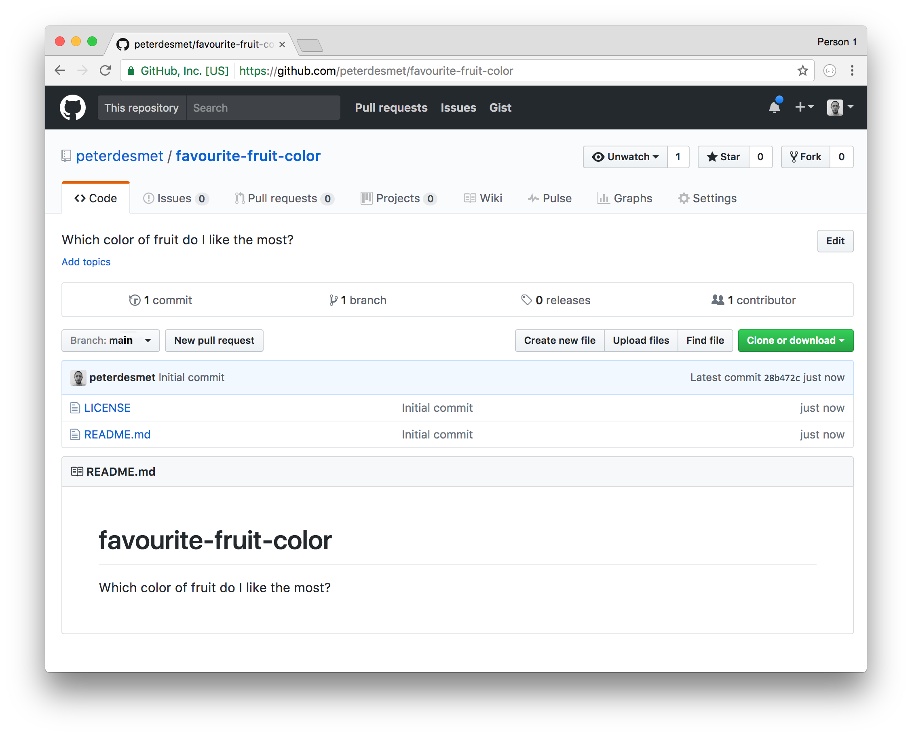


:::bulb
**Rircoda**: il tasto verde "Clone and Download", nell'ultima versione di GitHub è chiamato "Code", poco importa. Quel tasto è un mattone importantissimo per quello che vedremo durante questo tutorial e ci sarà molto utile tra poco!
:::

---

## La configurazione di Git per RStudio

Dato il fatto che useremo Git(Hub) per amministrare esclusivamente scripts R/Rmarkdown, l'integrazione di RStudio con Git fa proprio al caso nostro fornendo un'interfaccia facile e intuitiva come VCS (**V**ersion **C**ontrol **S**ystem) e permettendoci di rimanere all'interno di un'unica IDE.
Esistono altri git clients, detti **SCM**, che si differenziano per ulteriori funzionalità e offerta di piani: alcuni clients sono per intero a pagamento, alcuni offrono un piano _freemium_ con limitazioni e altri totalmente open source, [qui una lista completa](https://git-scm.com/downloads/guis) di tutte le offerte disponibili.

Alcuni personalmente sperimentati:

* [gitKraken](https://www.gitkraken.com/) client notevole e veloce (scelta default per chi sta scrivendo). Molti addons come Trello o Jira (supporta Bitbucket e Gitlab, omologhi di GitHub). Interfaccia semplice e intuitiva. Permette di costruire linee del tempo per tenere traccia di traguardi nello sviluppo. Permette di avere una lavagna di Kaban per assegnare (nello stile di Trello) obiettivi ai collaboratori. sviluppo su repo private non concesso. Possibilità di collaborazione direttamente su Kraken. Interoperabile, va bene per Windowws, Linux e MacOS.
* [git-fork](https://git-fork.com/) Vincenzo può aiutarmi @vicnardelli
* [GitHub Desktop](https://desktop.github.com/) cliet ufficiale di GitHub per git, non proprio intuitivo e probabilmente non la miglior scelta per un utente che intende usare solo R.
* [Sourcetree](https://www.sourcetreeapp.com/) gratis, fatto per Windows, e per questo motivo non consigliato per tutto il resto dei sistemi operativi su cui fa fatica e commette errori che non vengono risolti dai mantenitori del client.


### Installazione

:::warn
**Attenzione**: Sii assolutamente sicuro che tu abbia installato i requisiti del setup al paragrafo 1. 
:::

Nel caso tu non lo avessi fatto:

<div class="bs-callout bs-callout-exercise">
<h4>Esercizio:</h4>
1. Installa [RStudio](https://www.rstudio.com/products/rstudio/download/) dal sito ufficiale e seleziona la versione corretta per il tuo sistema operativo.
1. [Download](https://git-scm.com/downloads) di Git
</div>

Quando sono installati e funzionano correttamente allora:

<div class="bs-callout bs-callout-exercise">
<h4>Esercizio:</h4>
1. Apri [RStudio](https://inbo.github.io/tutorials/installation-RStudio-user.html)
</div>

---

### Configurazione (potrebbe essere diversa)

Per cominciare ad utilizzare lo strumento di versioning dobbiamo impostare una configurazione, fortunatamente lo facciamo _una tantum_.

Per prima cosa è necessario indicare ad RStudio dove si trova l'executable di Git (il file tramite cui Git esegue i comandi).

<div class="bs-callout bs-callout-exercise">
<h4>Esercizio:</h4>
1. Vai su`Tools > Global Options`
1. Clicca su `Git/SVN`.
1. Assicurati che: *Enable version control interface for RStudio projects*
1. Imposta il path che punta diretto all'executable di git (dove c'è l'installazione)
1. Assicurati che *use Git bash as shell for Git projects*
</div>

---

Se non ti ricordi o non sai dove hai installato git e l'eseguibile di git (il **punto 4** dei passaggi precedenti) allora apri il terminale da Windows con WIN+R e scrivi `cmd` e premi invio (su Mac apri Bash). Aperto il prompt comandi scrivi `where git` e premi invio, il prompt ti risponderà dove si trova il file. confronta la tua risposta con la mia: `C:/Program Files (x86)/Git/bin/git.exe`, è simile? Se sì procedi avanti.

Se invece riscontri ancora problemi con la ricerca dai un'occhiata [a questa risorsa](http://happygitwithr.com/rstudio-see-git.html#tell-rstudio-where-to-find-git).

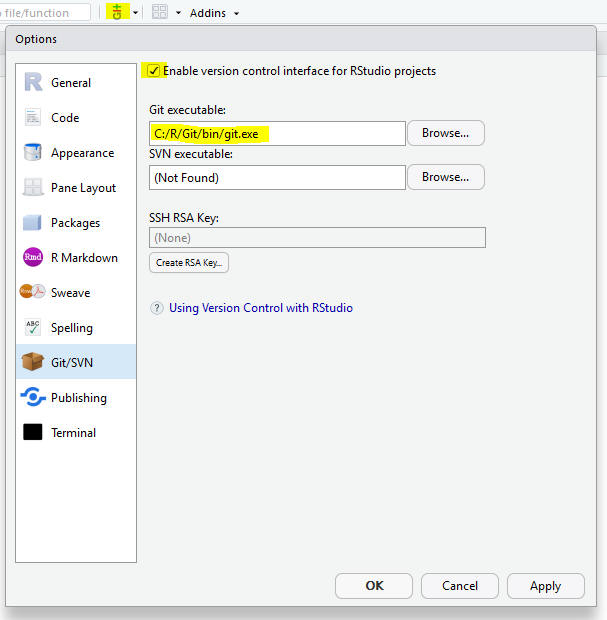{width=50%}

---
Adesso dobbiamo comunicare a GitHub chi siamo, con l'obiettivo di stabilire una connessione tra la nostra interfaccia di sviluppo locale IDE (RStudio ) e l'account online di GitHub. Per farlo git ha bisogno delle credenziali di GitHub, cioè username e GitHub email:

<div class="bs-callout bs-callout-exercise">
<h4>Esercizio:</h4>
1. vai su `Tools > Shell` e apri shell
1. nella shell, scrivi i seguenti comandi e premi invio.
```
git config --global user.name "mygithubusername"
```
1. Sempre nella shell scrivi il seguente comando completando con la mail di registrazione e premi invio:
```
git config --global user.email "my.name@gmail.com"
```
</div>

---

{width=75%}


Mi raccomando usa il tuo **username GitHub**, il mio è [NiccoloSalvini](https://github.com/NiccoloSalvini)!

Per verificare che tutta la configurazione sia andata a buon fine esegui questo comando: `git config --global --list`

Se la configirazione ha avuto esito positivo allora congratulazioni, il tuo setup è finito! 👍

---


Se sei scomodo con la configurazione da terminale, recentemente il pacchetto `usethis` ha introdotto una serie di funzioni per interagire direttamente con Git e GitHub. Qui copriamo solo lo "handshake" tra Git e RStudio, ma `usethis` copre molte altre operazioni come la **P**ull **R**equest, creazione di documentazione e di file Mardown precomilati (Lincenze, Codice di Condotta etc.). una sezione sarà interamente dedicata al set up completo tramite `usethis`:


```{r usethis, eval=F}

## Installa il pacchetto se necessario (solo una volta)
## install.packages("usethis")

library(usethis)
use_git_config(user.name = "Jane Doe", user.email = "jane@example.org")

```

Per verificare la corretta configurazione esegui lo stesso comando da terminale:

```
git config --global --list
```

## Clona una repo per lavorarci in locale

Prima abbiamo inizializzato una repo online e abbiamo configurato git per cooperare con RStudio. Adesso possiamo cominciare a lavorare sul codice localmente scaricando la repo sul laptop. RStudio provvede ad occuparsi di tutto questo in una maniera molto conveniente e facile. 

<div class="bs-callout bs-callout-exercise">
<h4>Esercizio:</h4>
1. vai sulla pagina GitHub della tua nuova repo copiando l'url **HTTPS** (*ricordi il bottone di prima?*)
1. in Rstudio prosegui per `File > New Project...`, seleziona `Version Control` e scegli `Git`
1. nella prima casella in alto, copia e incolla l'url **HTTPS** (in automatico il nome della cartella che contiene il progetto viene completata)
1. naviga fino alla cartella copiata dove desideri mettere tutti i tuoi progetti/codici R.
</div>

--- 

Per avere l'indirizzo **HTTPS** di clone della repo é sufficiente cliccare sopra <span style="color: green;">code</span> e premere sul piccolo bottone accanto all'indirizzo per copiare direttamente su clipboard (in alternativa seleziona e copia tutto l'url).

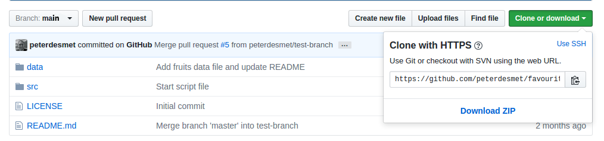{width=75%}

---
Un esempio di setup del progetto utilizzando una repo Git può essere questo:

{width=75%}

---

<div class="bs-callout bs-callout-exercise">
<h4>Esercizio:</h4>
Cerca la cartella che corrisponde alla git repo nella destinazione al punto 4 dell'esercizio. Il contenuto della cartella corrisponde a quello che c'è nella repo online?
</div>

---

## `.gitignore`

Quando si inizia un nuovo progetto in RStudio, ma anche in Python e tanti altri linguaggi è utile (anche se non propio indispensabile) aggiungere il file `.gitignore` se non esiste già. E' infatti possibile in fase di inizializzazione della repo online, direttamente da GitHub, creare il `.gitignore` default o custom (se hai difficoltà a comporre il file `.gitignore` assicurati di trovare un progetto simile al tu su GitHub e copia il contenuto, in alternativa naviga in [questo strumento online gratuito](https://www.toptal.com/developers/gitignore) speficificando i software che utilizzi e in automatico questo comporrà il perfetto `.gitignore`).
Il file `.gitignore` definisce tutti quei files che **non** devono finire nella repo online per diversi motivi, eccone alcuni:

- ci sono delle credenziali segrete `.Renviron` o`.Rprofile`  ( TODO: link a come storare credenziali segrete in R)
- files di sessione `.RData`
- files di logs e history `.Rhistory` e `.Rapp.history`
- file di sistema prodotti da RStudio, come`myprojectname.Rproj` 
- file specifici dell'utente `.Ruserdata`
- files temporanei creati da R Markdown, esempio: `*.utf8.md` e `*.knit.md`.
- files/ cartelle di cache come  `*_cache/` o `/cache/`
- tokens per [OAuth2 authorization](https://github.com/r-lib/httr/releases/tag/v0.3), come `.httr-oauth`
- Se stai scivendo un pacchetto: files di risposta in seguito ad un **R CMD build**, come `/*.tar.gz`; files di risposta in seguito ad un **R CMD check** come `/*.Rcheck/`
- altri che dipendono dalle esigenze specifiche del progetto espressi con una sintassi particolar, come tutti i files preceduti da "_" nel build con `bookdown`

Quindi rimandendo sullo stretto necessario se non c'è già possiamo aggiungere un file di testo (`File > New File > Text File`) rinominandolo `.gitignore` e aggiungere nel file il seguente testo `myprojectname.Rproj`, in alternativa come nell'esercizio:

<div class="bs-callout bs-callout-exercise">
<h4>Esercizio:</h4>
1. vai sul `git` pane (la tab dove c'è scritto Git), 
1. tasto destro sopra il file `....Proj` e seleziona nel men+ a tendina `Ignore...`
1. controlla se iul contenuto del `.gitignore` è correttamente aggiornato, poi clicca `Save`.
</div>

---

Visto che il nostro porgetto dummy èp rinominato `favourite-fruit-color`, il corrispondente `.Rproj` file è `favourite-fruit-color.Rproj`. Cliccando il tasto destro del muose sul file è possibile selezionare ignora:

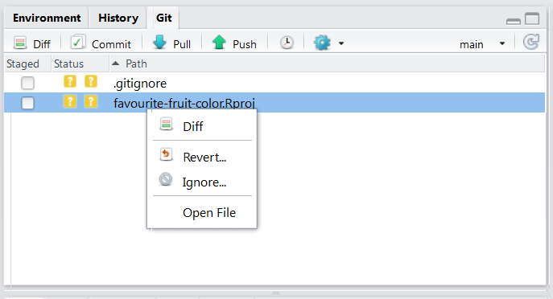{width=75%}

---

Linee guida su quando è necessario usare il file `.gitignore`:

* in ogni linguaggiuo di progrannazione dove alcuni files dono *derivati* di altri
* quando ci sono informazioni sensibili che non devono assolutamente essere condivise e non possono essere immagazzinate negli scripts (passwords di Accounts, di database, tokens di Dropbox, etc...)
* quando c'è una cartella con files di grandi dimensioni che non deve finire nella history (bensì backed up da qualche altra parte)
* una cartella con files temporanei o con esempi come _temp/_ o _*-Ex.R_

---

Nota che la sintassi del `.gitignore` è molto intuitiva e permette tramite wildcards di estendere l'ingnore a tutti i files con la medesima estensione ( per esempio `*.Rproj`) o con il medesimo prefisso o suffisso.

{width=75%}

---

Controllla il contenuto del `.gitignore`, se sei soddisfatto premi `Save`:

{width=75%}

---

## Fa il **commit**

Visto che il `.gitignore` è stato modificato git ha registrato un cambiamento nella <span style="color: green;">repo locale</span> che non è nella <span style="color: red;">repo online</span> di GitHub.
Allora data la nuova aaggiunta/modifica del presistente `.gitignore` possiamo fare il `commit` di questo cambiamento e fornire un messagio ce spieghi il cambiamento fatto.

<div class="bs-callout bs-callout-exercise">
<h4>Esercizio:</h4>
1. Vai sul `git` pane
1. Spunta la casella accanto a `.gitignore`
1. Clicca `Commit`
1. Aggiungi un messaggio premendo su `commit message` e clicca commit
1. Clicca `Close` per rimuovere il summary del commit
</div>

---

Adesso lo stato del `.gitignore` prima che il file venga committato è giallo con un punto interrogativo accanto. Questo significa che Git ha notato un cambiamento/aggiunta di quel file.

{width=75%}

---

Spuntando la casella accanto al `.gitignore` (oppure selezionandolo e premendo invio) e cliccando su commit si apre una finestra di dialogo dove viene chiesto a destra di inserire un messaggio di commit. 
(rivdere) 
Ogni messaggio di commit ha un header, cioè un titolo dove viene spesso riassunto il cuore di quello che è stato fatto per poi lasciare uno spazio bianco sotto l'headere ed elencare con un elenco puntato e numerato quali sono materialemente le operazioni fatte o il motivo. Il messaggio di commit è una vera e propria **arte** deve essere _semplice_, _chiaro_ e sempre nell'ottica di far capire ad un terzo, molto probabilmente te nel futuro cosa tu abbia fatto e perchè lo hai fatto. [Questo post](https://chris.beams.io/posts/git-commit/) può aiutarti a scrivere in maniera più efficace un commit seguendo alcune linee guida.
Alcuni SCM (non quello intgrato nella IDE di RStudio) prevedono la possibilità di creare un template per il commit, cosicchè ogni volta che un file o un gruppo di files viene committato un template di commit viene generato e il processo di revisione del codice è meglio struttuato e più riproducibile. 
Dietro questa semplice operazione ci sono 


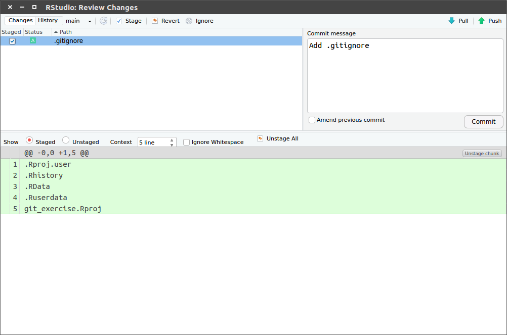{width=75%}

---

Dopo questo abbiamo una piccola panoramica tecnica di quello che sta succedendo (quello che è stato aggiunto, quello che è stato tolto, quello che è stato modificato)

{width=75%}

---
E buona pratica **committare spesso**. Questo permette di spezzettare la logica dello sviluppo del software in tante e piccole singole operazioni su cui si può intervenire in maniera stagna. L'uso frequente di commits permette anche di evitare alcuni probelmi comuni sia di GitHub che di RStudio. Un problema è il tempo di attesa del commit, infatti il git pane di RStudio è molto pratico ma non è ottimizzato. Fare un commit molto grosso con tanti files potrebbe richiedere molto tempo e in alcuni casi git potrebbe sputare un errore. (related issue)

La documentazione è un aspetto cruciale dello sviluppo di ogni software, prima ancora che per gli altri **per te stesso**. Il file `README.md`  ti aiuta a capire lo scopo del progetto. Adesso possiamo provare a modificare il file `README.md` localmente e procedere alla stessa maniera.

<div class="bs-callout bs-callout-exercise">
<h4>Esercizio:</h4>
1. Aggiorna il file `README.md` direttamente da dentro RStudio
1. Commit i cambiamenti
</div>

---


Ricorda che il report dei cambiamenti nel panel in basso barra in rosso le linee di codice che sono sparite dal file e in verde quelle aggiunte o modificate:

{width=75%}

---

## Push dei cambiamenti su GitHub

Nota che `git` ti avverte che *your branch is ahead of 'origin/master' by 2 commits*, questo significa che ancora i tuoi cambiamenti sono in fase di stage, devono ancora essere trasmessi alla repo di GitHub online. Per trasmettere i cambiamenti a GitHub premi `push`.

<div class="bs-callout bs-callout-exercise">
<h4>Esercizio:</h4>
1. Clicca `push` nel `git` pane
1. Vai su GitHub all'indirizzo della tua repository e verifica il commit, il messaggio e i cambiamenti
</div>

---

RStudio successivamente ti avverte sullo stato dei tuoi commits locali rispetto a quelli mandati `push`ed a GitHub:

{width=75%}

---

Adesso su GitHub il `README.md` è aggiornato? Dove si trova la panoramica dei commits sulla repo online?

{width=75%}

---

## Configurazioni Addizionali - metti da parte la password 🔑

Non è per caso noioso tutte le volte rimettere la propria password ogni volta che viene `push`ato qualcosa alla repo?  
Fortunatamente così come per _Username_ e _mail_, anche con la password è possibile fare la stessa cosa usando il protocollo sicuro **HTTPS**.

<div class="bs-callout bs-callout-exercise">
<h4>Esercizio:</h4>
1. Clicca su `More` nel `git` pane e seleziona `Shell`
1. Scrivi `git config --global credential.helper store` e premi invio
1. Scrivi `exit` e premi invio per uscire dalla shell
</div>

La prossima volta che `git` avrà bisogno delle tue credenziali **te le chiederà solo una volta** e le manterrà per tutte le operazioni successive.

---

Il bottone "More" ha il simbolo di un **ingranaggio** ⚙️: 

{width=75%}


---

## Crea un commit logico

Come anticipato prima, la buona pratica di sviluppo di software prevede di committare spesso e mappare in modo chiaro e sintetico la relazione tra problema da risolto e codice cambiato/aggiunto. Tuttavia alcune volte questo prevede che l'aggiunta di cambiamenti alla codebase avvenga in due diversi commits. L'interfaccia di RStudio include anche la possibilità di specificare qualche linea di codice nel messagio del commit:

{width=75%}

---

Per riassumere, le diverse fasi che intercorrono tra una operazione di commit e la successiva possono essere:

- `stage xyz`: aggiungi xyz dal commit
- `unstage xyz`: rimuovi xyz dal commit
- `discard xyz`: revert (ritorna indietro) rispetto ai cambiamenti su xyz ( `r emo::ji("warning")` stai attento, questo non può essere riportato indietro! `r emo::ji("warning")` )

E `xyz` può essere

- una `linea` singola
- una `selezione` di linee
- un `chunk` di codice
    - RStudio si occuperà di spezzare i cambiamenti in più chunks
    - I chunks sono definiti come 10 linee di codice non cambiate tra gli effettivi cambiamenti

---

<div class="bs-callout bs-callout-exercise">
<h4>Esercizio:</h4>
1. Effettua due differenti cambiamenti al `README.md` localmente
1. Crea un `commit` per ogni cambiamento tale che:
    1. Seleziona il cambiamento e mettilo in `stage`
    1. Aggiungi un messaggio di `commit` e clicca su `Commit`
1. non `Push`are (ancora...)
</div>

---

## Crea un Conflitto

Alcune volte accade, soprattuto in ambienti molto collaborativi o con tanti contributori che più collaboratori lavorino sulle stesse linee di codice. Non c'è da preoccuparsi, adesso impariamo ad amministrare i conflitti e risolverli. Lo faremi creandone uno.

<div class="bs-callout bs-callout-exercise">
<h4>Esercizio:</h4>
Aggiorna il `README.md` direttamente online su GitHub, sulla stessa identica linea che hai cambiato nell'esercizio precedente.
</div>

---

Se non ti ricordi o non sai come si fa un cambiamento online, per favore controlla [questo tutorial](https://help.github.com/articles/create-a-repo/#commit-your-first-change). Guarda poi i risultati online del commit. Ricorda che non c'è  bisogno di spingere i cambiamenti  `Push`ando il commit, siamo già online, non serve, infattic contestualmente `Push`ando cambia immediatamente il contenuto della repo.

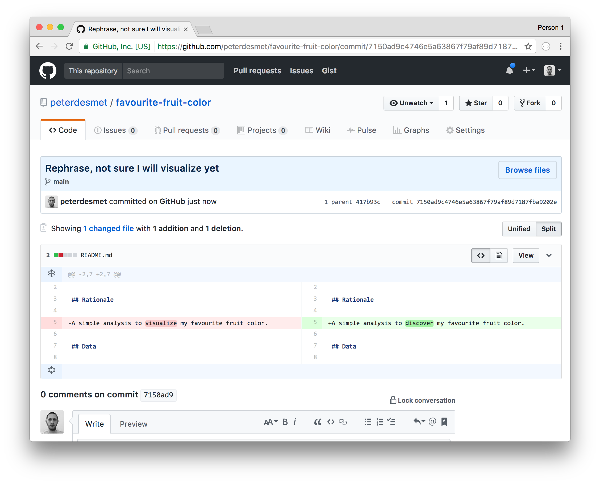{width=75%}

---

<div class="bs-callout bs-callout-exercise">
<h4>Esercizio:</h4>
Torna indietro su Rstudio e prova a spingere (click `push`) i cambiamenti locali.
</div>

---
Git ti aiuta avvertendoti che ci sono dei cambiamenti remoti ( _remote changes_ ) sulla stessa repo.

{width=75%}

---

<div class="bs-callout bs-callout-exercise">
<h4>Esercizio:</h4>
Clicca su `Pull` per tirare i cambiamenti dentro la tua repo GitHub (fare il download) 
</div>

Git ti notifica un conflitto i.e. **CONFLICT** e ti chiede cosa vuoi fare, le operazioni da fare sono 2:

1. Metti a posto il conflitto
1. Commit del risultato dopo aver messo a posto il conflitto

{width=75%}

---

Adesso con calma va risolto il conflitto!

Ogni conflitto è sempre evidenziato con la seguente sintassi:

```
<<<<<<< HEAD
il tuo codice locale
=======
il codice che esiste su GitHub
>>>>>>> origin/master
```x

Per risolvere il conflitto devi decidere quale delle due versioni ti convince di più viceversa e quale vuoi scartare.

---

<div class="bs-callout bs-callout-exercise">
<h4>Esercizio:</h4>
1. Apri il `README.md` in RStudio:

        <<<<<<< HEAD
        A simple analysis to visualize my favourite fruit colour.
        =======
        A simple analysis to discover my favourite fruit color.
        >>>>>>> origin/master

2. Scegli solo la _versione_ preferita (in questo caso quella su GitHub):

        A simple analysis to discover my favourite fruit colour.

3. Committa il risultato
4. Clicca su `Push` per aggiornare GitHub
</div>

Se tu dovessi incontrare nuovi conflitti in futuro utilizza il semplice _modus operandi_ che hai appena visto.

---

## Aggiungi un nuovoi file

Durante lo sviluppo di un progetto nuovi files sono introdotti, pure questi necessitano di un controllo di versione!.
Le nuove cartelle insieme ai files possono essere aggiunte e successivamente committate, esattamente come ogni altro cambiamento.

Spuntando la casella accanto al nuovo file/cartella appena aggiunto viene messo in fase `stage`. Mettere in `stage` una nuova cartella metterà in automatico ogni file contenuto nella cartella. 
Tuttavia RStudio non ti permetterà di mettere in `stage` una cartella vuota!

<div class="bs-callout bs-callout-exercise">
<h4>Esercizio:</h4>
1. Aggiungi il file `fruits.csv` all'interno di `/data` (subdirectory)
1. Aggiungi un collegamento a file `README.md` (usando il path relativo), menzionando la funzione del file
1. Adesso Commit tutti e due i cambiamenti (il nuovo file `fruits.csv`  e le modifiche apportate al `README.md`) in un singolo messaggiio di commit
</div>
---

RStudio provvede ad informati circa lo status dei files

- `README.md` file è stato cambiato (<span style="color: blue;">M</span>odified)
- `data/` è per il momento sconosciuto a git (*Question mark* <span style="color: yellow;">?</span>)

{width=75%}

---

Sputando tutti e due li farà diventare pronti per il commit. Ricorda che `data/fruits.csv` diventa verde visto che viene <span style="color: green;">A</span>ggiunto:

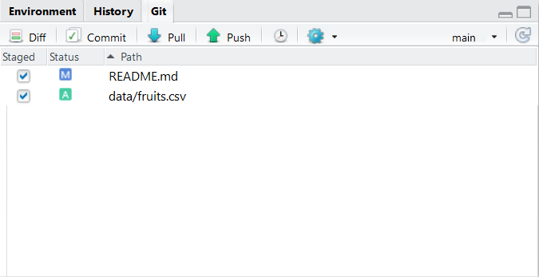{width=75%}

---

## Adatta l'ultimo commit

Succede spesso che vengano committate linee di codice ma ci si dimentichi di altre o che quelle stesse necessitino una piccola revisione. Git provvede attraverso l'abilità `amend` modificando il precedente commit con gli adattamenti necessari.

<div class="bs-callout bs-callout-exercise">
<h4>Esercizio:</h4>
1. Fai un cambiamento in `fruits.csv`
1. `Commit` come sempre, ma **spunta** la casella `amend previous commit` (accanto al bottone `Commit`)
</div>


:::warn
**Attenzione:**  non lo fare per commits che sono già stati pusha, altrimenti incorri in un conflitto!
:::


---

Poi, accanto all bottone `Commit`, spunta l'opzione `amend` previous commit:

{width=75%}

<!-- <div class="question">`  -->

<!-- 1. Prima domanda? -->
<!-- 1. Seconda domanda? -->

<!-- </div>` -->


---

## Guarda l'history

Uno dei vantaggi di usare uno strumento di verion control come Git, _assumendo commits regolari_, è poter avere la cronistoria commentata di tutto il lavoro sul progetto. E' possibile infatti guardare l'History (la serie di `commit`) sia online che in locale su RStudio.

<div class="bs-callout bs-callout-exercise">
<h4>Esercizio:</h4>
1. All'interno di RStudio clicca su `history`, nel `git` pane 
1. Sulla pagina della repo controlla la lista dei commits 
</div>

---

Nota la preseza di `History` due volte nella seguente immagine:

- Come pane separato (la storia di tutti i comandi R eseguiti nella sessione): non ha niente a che fare con Git ❌
- All'interno del `git` pane (la history dei commits) ✔️

{width=75%}

---

Clicca su ciascuno dei commits per vedere le modifiche apportate, tieni d'occhio in alto a sinistra il flusso dei commits.

{width=75%}

---

## Crea un branch

### Come si fa un nuovo branch?

E' buona pratica **tutte le volte** che si lavora su codice proprio o altrui lavorare su branches _a scadenza_. Questo ti permette di sperimentare liberamente finchè non sei soddisfatto, senza però compromettere il `master` branch (il codice principale, dove è contenuta versione stabile del codice). Per "a scadenza" s'intendono modifiche sul codice di un progetto/analisi che hanno vita breve, cioè che auspicabilmente in un momento successivo possano essere riunite al branch principale (`master`) o scartate.


<div class="bs-callout bs-callout-exercise">
<h4>Esercizio:</h4>
1. Clicca su `New branch` symbol* (accanto al nome corrente del branch)
1. Assegna un nome al nuovo branch (minuscolo e senza spazi, vanno bene under traits)
1. Mantieni il remoto come `origin`
1. Spunta la casella `Sync branch with remote`
1. Clicca su `Create`
</div>

*il simbolo `New branch` è questo:
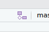

---

Assicurati che il nome del branch abbia senso rispetto ai cambiamenti che pianifichi di fare. E' buona pratica adottare una sintassi standard per nomi di branch che vuole:

- Tutti i caratteri minuscoli
- Non più di 20 caratteri
- Nessuno spazio
- se nome composto usare snake cases ( `_` o  `-` )

In questo esempio decidiamo di chiamarlo: `analysis-script`.

{width=75%}

---

:::warn
**Attenzione**: Alcune versioni precedenti di RStudio non hanno la funzionalità di creare branch! 
In questo caso o aggiorni RStudio alla ultima versione o utilizzi la `Shell` per creare un nuovo branch.
:::

<div class="bs-callout bs-callout-info">
<h4>Approccio per creare un nuovo branch da Shell:</h4>
1. Apri la `Shell`
1. Crea un new `branch` da `checkout`
    ```
    git checkout -b analysis-script
    ```
1. Verifica la creazione del branch vedendoli tutti con: `git branch`
1. Scrivi `git push -u origin analysis-script` per attivare `Push`/`Pull` sul branch

L'approccio con la Shell per creare un nuovo branch:
{width=75%}

Questo attiverà anche i bottoni `pull` and `push`. Da ora in poi si può committare liberamente sul branch seguendo il _modus operandi_ visto finora.

:::bulb
**Ricorda**: Da ora in poi tutti i cambiamenti che farai saranno registrati sul nuovo branch, pertanto quando farai un commit e pusherai alla repo remota potrai vedere i rispettivi cambiamenti cambianto il branch anche su Github, cioè passando da `master` a `analysis-script` nella repo online.
:::

{width=75%}
</div>

---

Adesso possiamo lavorare sul nuovo branch e cominciare a cambiare o aggiungere files.

<div class="bs-callout bs-callout-exercise">
<h4>Esercizio:</h4>
1. Aggiungi un file di analisi nella subdirectory  `/src`
1. `Commit` i cambiamenti al nuovo branch
1. Clicca `Push` per mandare i cambiamenti a GitHub 
1. Procedi su GitHub, cerca il nuovo branch e verifica il commit
</div>

---

### Gli effetti di cambiare branch

La prima volta che è cambiato un branch si notano files che spariscon, non ti preoccupare, non hai perso niente, adesso ti chiederai cosa sia succeso a quei file. 
Git si prende cura di farti vedere solo quei files che sono rilevanti per quel branch attivo, 
Nel prossimo esercuzio vedremo questa proprietà più in dettaglio.

<div class="bs-callout bs-callout-exercise">
<h4>Esercizip:</h4>
1. Clicca nel dropdwon menu sul the `git` pane (in alto a destra)
1. Cambia nuovamente il branch selezionando `master`, `(LOCAL BRANCHES) -> master`
1. Verifica la struttura delle cartelle in locale nel file explorer, dove sono andati a finire i files aggiunti?
1. Adesso cambia ancora il branch ritornando sul nuovo branch (in the example i.e. `analysis-script`)
1. Riverifica la struttura delle cartelle col file explorer, dove sono i files ora?
</div>

---

Come nel nostro esempio, il nome del branch è `analysis-script`, il dropdown menù segnala che ci troviamo nel branch attivo, cioè `analysis-script`. Adesso cliccandoci vediamo tutti i branch correnti, nell'esempio due: `master` (il principale) e `analysis-script` il nostro dev. `dev` viene spesso usato come nome per `dev`eloping branches.
Clicchiamo su `master`.

{width=75%}

---

RStudio fornisce le informazioni sullo switch di branch appena effettuato verso `master` segnalandoci: 

* Che il branch da cui siamo appena partiti `analysis-script` è **avanti** di 1 commit rispetto al `master`, quello dove siamo ritornati.
* log di notifica di passaggio: adesso siamo in `master`


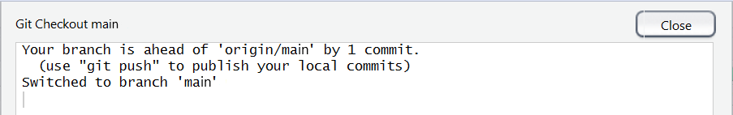{width=75%}
:::warn

**Attenzione**: se qualcosa non torna riverifica che il lavoro che hai svolto aggiungendo files in `/src` sia effettivamente sul branch `your-new-branch-name`.
:::


---

## **P**ull **R**equests (PR)


Quando sei soddisfatto del lavoro sul branch di sviluppo, allora è il momento di unire (merge) i cambiamenti dal branch `analysis-script` a `master` (che ricordiamo essere le _versione stabile_ del codice). Assolutamente **MAI** unire i cambiamenti oin locale, piuttosto vai **SEMPRE** su GitHub nel branch online e effettua la `Pull Request`.

---

### Crea una **P**ull **R**equest

<div class="bs-callout bs-callout-exercise">
<h4>Esercizio:</h4>
1. Clicca su `push` (se non l'hai ancora fatto)
2. Vai su [Github](https://github.com/), e naviga all'indirizzo della tua repo online
3. Crea una `pull request` online
</div>

---

GitHub verosimilmente ti suggerirà un bottone verde `Compare & Pull request` sulla pagine scontornato da un riquadro giallo. Se non lo vedi puoi comunque inizializzare una pull request direttamente da lì. Fare una Pull Request significa unire il branch di sviluppo col branch della versione stabile del codice ed è sostanzialmente _il cuore di ogni contribuzione Open Source._

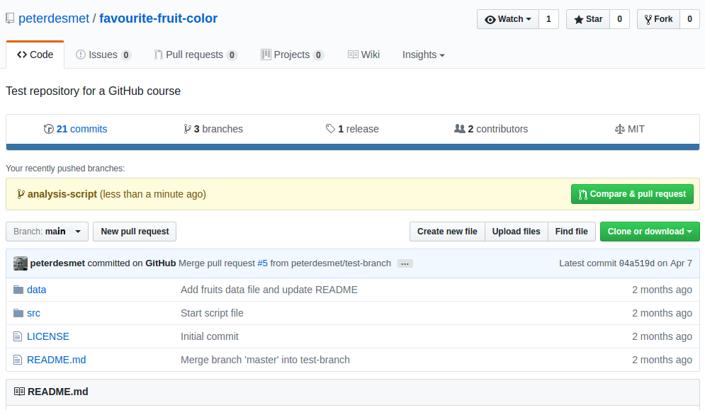{width=75%}

---

Nella finestra di dialogo riassumi in poche linee i cambiamenti apportati con la `Pull request` integrando le informazioni già inserite nel commit al branch di sviluppo. Successivamente clicca su `Create pull request`. Quello che stai facendo under the hood è chiedere il permesso al propietario della repo (te medesimo) di approvare ed unire i cambiamenti fatti dall'utente che ha creato la Pull Request (te medesimo).

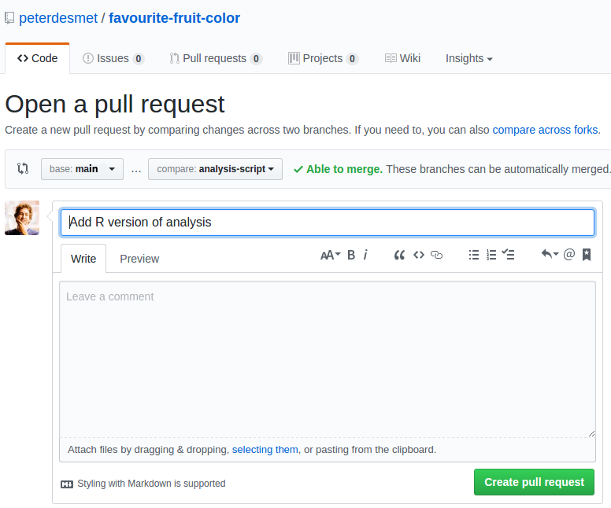{width=75%}

---

### Rivedere e approvare la PR

Finchè lavori da solo puoi essere abbastanza sicuro dei cambiamenti che fai e puoi in automatico evitare di rivedere la PR. Del resto controllore concide con controllante. Tuttavia questo può essere un buon momento per richiedere il controllo di qualcun'altro e stabilire dei check automatici dopo che il terzo soggetto che controlla ha effettivamente controllato (_automated checks_).

<div class="bs-callout bs-callout-exercise">
<h4>Esercizio:</h4>
1. Rivedi il tuo stesso codice!
2. Se va bene, allora unisci (merge) la `Pull request`. 
3. Non dimenticarti di rimuovere il branch che hai appena unito (Github te lo chiedo subito dopo)
</div>

---

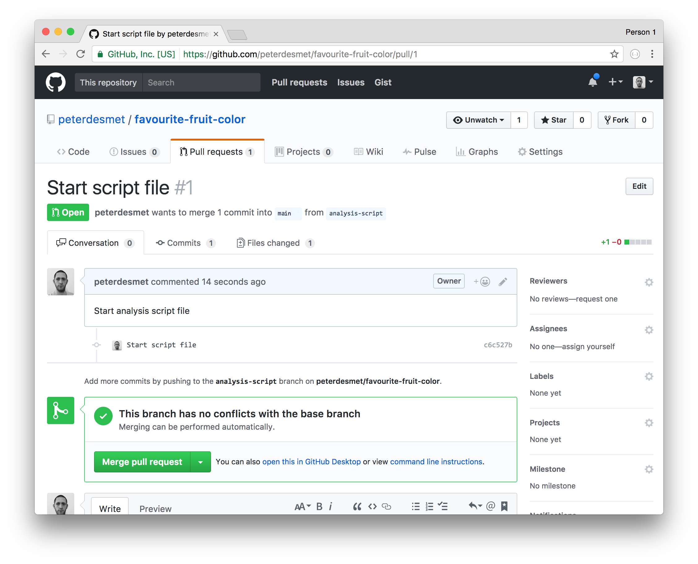{width=75%}


---

### Includi il tuo auto-verificato lavoro su `master`

Per il momento i tuoi cambiamenti sono integrati sul `master` online (solo su GitHub), ma non in locale (sul branch `master` del tuo progetto/analisi)
Allora a questo punto devi aggionare il tuo `master` locale:


<div class="bs-callout bs-callout-exercise">
<h4>Esercizio:</h4>
1. In Rstudio, cambia dinuovo il branch su `master` (operazione vista prima, da `Git` pane)
1. Clicca su `Pull`
1. Cancella il branch _scaduto_ (altrimenti all' n-esimo cambiamento avrai una lista infinita di branch). Apri la shell ed esegui:
    ```
    git branch -d analysis-script
    ```
</div>

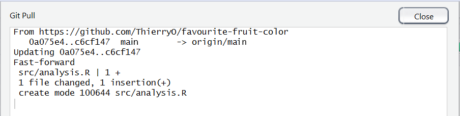{width=75%}

---

# Lavora con un Collaboratore {data-background=#c2c444}

---

## Invita un collaboratore

Finora hai imparato le principali operazioni per fare un uso personale, efficace e consapevole di Git con GitHub. Adesso possiamo fare un salto in avanti e creare un ambiente di collaborazione.


<div class="bs-callout bs-callout-exercise">
<h4>Esercizio:</h4>
* Alleati con due o più persone
* Lascia che una persona inviti le altre, fornendogli informazioni su permessi di scruttura e lettura come in [questo articolo](https://help.github.com/articles/inviting-collaborators-to-a-personal-repository/)
</div>

---

All'indirizzo della tua repo, in particolare nel pane `Settings`, nella colonna sinistra appare `Collaborators`. Previa richiesta di login è possibile invitare collaboratori e amministrare i tuoi diritti e quelli dei tuoi collaboratori.

{width=75%}

---

Qunado sei invitato a collaborare ti è richiesto di accettare l'invito `Accept invitation` per cominciare a lavorare sulla repo.

{width=75%}

---

## Issues (problemi)

Le issues sono comunemente utilizzate per molteplici scopi: allertare un collega di un <span style="color: red;">bug</span> sul codice, <span style="color: green;">proporre novità</span> o 
<span style="color: orange;">discutere di temi specifici dell'analisi</span>.
Tuttavia recentemente GitHub ha deciso di assegnare ad ogni azione un suo preciso posto, standardizzado così l'allocazione delle risorse del progetto. E' anche vero che la buona pratica di mettere le risorse dove _è giusto che stiano_ lascia spazio all'uso comune che i developers fanno degli spazi prima che i cambiamenti ci fossero, per questa ragione le issues raccolgono in sè anche contenuti che non hanno esattamente a che fare con problemi, piuttosto con soluzioni come le `Feature Request` (**FR**) o discussioni.
In particolare i cambiamenti riguardano:

- le `issue`s rimangono esattamente dove erano, ma per loro è possibile scrivere un template (blog post) che faccia in modo di facilitare sia la compilazione dell'utente (`reprex`) che la ricezione del problema del maintainer. Per abilitare e modificare i template per issues (ed altri) è `Settings > Options > Features`. Le `issues` ricorpono il ruolo di <span style="color: red;">bug</span> e di <span style="color: green;">Feature Request</span>.
- le <span style="color: orange;">discussioni</span> che riguardano la metodologia adottata nel progetto/analisi hanno un nuovo luogo: `Discussion`, attivabile spuntando la cassella al medesimo percorso dei templates. Tuttavia l'adozione non è ancora largamente diffusa quindi spesso le stesse discussioni finiscono dentro le `issue`s.  
- le informazioni che riguardano il progetto/analisi possono essere contenute nella sezione Wiki (attivabile allo stesso percorso). Tuttavia, se il progetto non è mastodontico, è uso comune includere la documentazione nel `README.md` o dedicare un sito al progetto con la documentazione da attaccare alla repo (molto diffuso per i pacchetti).

Le


:::warn
**Attenzione**: Ogni developer può includere le proprie linee guida su come e dove contribuire (o sottoforma di bug report, di feature request o di PR), alla repo in un foglio markdown nominato `CONDUCT.md`
dove è tenuto anche a specificare i toni e i termini a cui la discussione si deve attenere (tema molto caro per gli autori americani). Occorre anche ricordare che le linee guida della "buona contribuzione" sono in continua evoluzione e specifiche di ogni linguaggio e di ogni comunità attorno al linguaggio, per questi motivi è una buona mossa adottare le buone pratiche promosse dai maggiori contributori.
:::


<div class="bs-callout bs-callout-exercise">
<h4>Esercizio:</h4>
* Solleva un problema sul codice tramite una `issue` online
* Assegna alla issue la rispettiva `label`
* Assegna un collaboratore/collega alla `issue` cosicchè se ne occupi!
</div>

---
## Cambiamenti Online

Se non c'è coinvolgimento di codice nella risoluzione del problema (`issue`) sollevato da un utente allora questo pul essere completamente svolto online da GitHub tramite la sezione dedicata:

<div class="bs-callout bs-callout-exercise">
<h4>Esercizio:</h4>
* Fai un adattamento ad un file
* Proponi una `pull request` e assegnala ad un collaboratore
* Unisci (`master`) il cambiamento al `master` branch
</div>

---

## Adattamenti locali

In questa sezione ogni singolo passo fatto finora viene messo insieme simulando una collaborazione per un progetto. I semplici passi proposti standardizzano e guidano un _modus operandi_ sicuro, efficiente, efficace e _in linea coi tempi_ per affrontare progetti in ambienti open source o meno data la stack di tecnlogie che abbiamo a disposizione.

:::warn
**Attenzione**: Si lavora SEMPRE in locale e poi si fa merge dei branch online. Ripeti questa cantilena per il numero di volte che vuoi fare un cambiamento.
:::

---

Riassumendo tutto, ecco la sequenza di operazioni affrontate nelle sezioni precedenti che compongono il naturale sviluppo di un software (anche su R):

<div class="bs-callout bs-callout-exercise">
<h4>Passo dopo Passo:</h4>
* Come collaboratore, `clone` la repo in locale sul tuo computer
* Crea un nuovo `branch` in locale
* Adatta il file sulla base del cambiamento che vuoi apportare
* `Commit` del cambiamento
* `Push` del `branch` alla repo remota (GitHub online)
* Vai alla repo GitHub e crea la `Pull request`
* Rivedi il tuo lavoro, completa un messaggio esaustivo e approva la `Pull request` se ti soddisfa.
* Cancella il `branch` _scaduto_
* Aggiorna il tuo lavoro in locale facendo `Pull`
* Controlla se gli adattamenti sono stati trasmessi in locale e corrispondono a quelli in remoto (su GitHub)
</div>


---

## Workflow da RStudio

Gli steps riassunti prima forniscono un workflow generale di come si contribuisce ad una repository su GitHub secondo le [sue stesse linee guida](https://guides.github.com/introduction/flow/). Tuttavia, quando si lavora ad un progetto, non è detto che le cose siano state messe in piedi esattamente come abbiamo fatto noi; per questo motivo ho composto un uno spazio separato con [un workflow](./workflow_rstudio.html) che auspicabilmente copre alcuni scenari non visti nei semplici passi visti prima.

---

## Release (Rilascio della versione)

Quando ti ritieni soddisfatto dello stato del tuo progetto/analisi, allora puoi scegliere di rilasciarlo con un Release.
I Release sono dei _checkpoints_ delle versioni del codice che aiutano _in primis_ te a tenere traccia delle pietre miliari raggiunte nello sviluppo del codice e _in secundis_ per gli utenti che auspicabilmente usufruiscono del tuo codice e possono scegliere quale release utilizzare (ed evitare, per esempio, problemi di compatibilità).
I release possono coinvolgere:

* Per Pubblicazioni (DOI)
* For code/software development versions
* For course notes

Dato che il release non è una questione di sostanza, sebbene utilissimo, ti reindirizzo verso [un tutorial](https://help.github.com/articles/creating-releases/) dalla documentazione originale di GitHub, verso [un altro](https://r-pkgs.org/release.html#:~:text=If%20you%20use%20GitHub%2C%20go,tag%20%2Da%20v1.2.3%20.) se l'interesse è quello di rilasciare una versione di un pacchetto.

---

# Alcune ottime regole per **collaborare in maniera efficiente, efficace ed educata**:

* Committa _spesso_, e committa _pochi contenuti_ alla volta
* Non mixare più contenuti nello stesso commit
* Rifletti sul messaggio di commit
* Committa sempre su branch nuovo, mai sul `master` branch.
* Aggiungi sempre nuove features dal `master` branch, mai dal `dev` (a meno di accordi particolari con il manutentore).
* Fai in modo di lavorare sempre sul tuo `branch`.
* Non unire mai la `pull request` di qualcun'altro senza il consenso degli altri.
* Non tenere aperti `branch` scaduti (in gergo tecnico, se lo fai crei debito tecnico)

---

> Che Git sia con te
>
> `r tufte::quote_footer('--- Yoda')`

<!--  -->

<p align="center">

</p>


