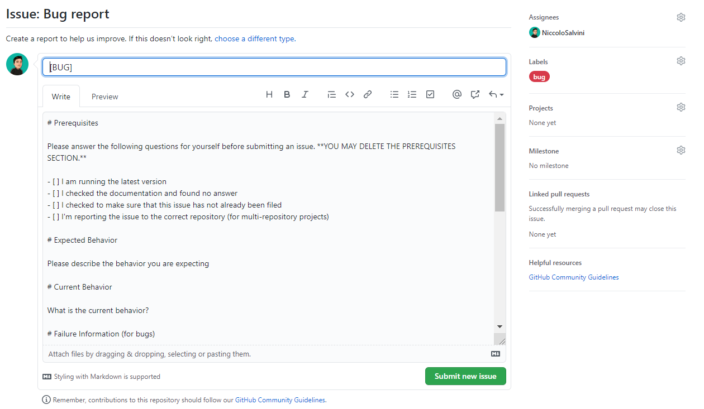

```{r setup, include=FALSE}
knitr::opts_chunk$set(echo = TRUE)

library(reprex, warn.conflicts = F, quietly = T)

```

## `issues` templates

Spesso è difficile risolvere un problema quando i dettagli importanti mancano o non sono ben evidenziati. Da febbario 2016 i manutentori/propietari di repo possono aggiungere dei templates prestabiliti ai loro loro progetti per `Issues` e `Pull Requests`. Facendo questo aiutano i contributori e collaboratori a condividere i dettagli necessari a cominciare una discussione.

Per aggiungere un template ad una repo è necessario creare un file `ISSUE_TEMPLATE` nella root dir. L'estesione del file è opzionale ma la buona pratica vuole che sia `.md` (è possibile avere una preview cliccandoci sopra come accade in automatico col `README.md`). L'estensione `.md`rende facile l'aggiunta di elementi come paragrafi, links, e menzioni a collaboratori, proprio come liste TODOs per i templates.

I templates per `Pull Requests` seguono lo stesso modello: aggiungi un file nominato `PULL_REQUEST_TEMPLATE` al root della tua repo.

Altrimenti procedi per `Settings > Features > Issues > Set up templates` (**scelta dell'autore**).

Se sei preoccupato del disordine nella root allora il consiglio è creare una dir `.github/` dove spostare `CONTRIBUTING.md`, `ISSUE_TEMPLATE.md`, and `PULL_REQUEST_TEMPLATE.md`. GitHub si occupererà si recuperare i files e tutto funzionerà esattamente alla stessa maniera.

Se vuoi approfondire oltre questo [ecco la documentazione](https://docs.github.com/en/communities/setting-up-your-project-for-healthy-contributions).

## Creazione Templates

Nel reindirizzamento dopo aver cliccato su `Set up templates` appare un opzione centrale "Add Tempalte" con un drop down menu. 


{width=75%}

Sotto ne sono stati creati due dall'autore sulla base di templates gia esistenti per azioni di **Bug Reporting** e di **Pull Request**. Niente vieta che tu ne possa scrivere altri per diverse azioni.

Per modificarle quindi naviga nella cartella del progetto su GitHub 


e andando nel Issues pane, vediamo due templates che rispondono alle due azioni concesse dall'autore. Immaginiamo di trovare un <span style="color: red;">Bug</span> nel codice e di volerlo segnalare.
Bug Report fa al caso nostro.

{width=75%}

---- 

E premendo su <span style="color: green;">Get Started</span> si arriva in:

----

{width=75%}

Da qui è necessario riempire i campi suggeriti dall'autore seguendo la sua struttura, rendendoci facile la vita evitandoci di dare informazioni superflue (risparmiando tempo); e facile per lui 
ricevendo lo stretto necessario a riprodurre il problema  `reprex` (qualche informazione in più su **Rep**roducible **Ex**ample, [pacchetto qui](https://reprex.tidyverse.org/) e [blog post qui](https://www.jessemaegan.com/post/so-you-ve-been-asked-to-make-a-reprex/)).
Puoi verificare il funzionamento di Bug Reporting e di Pull Request 


## Bug Report temp:

    # Prerequisites

    Please answer the following questions for yourself before submitting an issue. **YOU MAY DELETE THE PREREQUISITES SECTION.**

    - [ ] I am running the latest version
    - [ ] I checked the documentation and found no answer
    - [ ] I checked to make sure that this issue has not already been filed
    - [ ] I'm reporting the issue to the correct repository (for multi-repository projects)

    # Expected Behavior

    Please describe the behavior you are expecting

    # Current Behavior

    What is the current behavior?

    # Failure Information (for bugs)

    Please help provide information about the failure if this is a bug. If it is not a bug, please remove the rest of this template.

    ## Steps to Reproduce

    Please provide detailed steps for reproducing the issue.

    1. step 1
    2. step 2
    3. you get it...

    ## Context

    Please provide any relevant information about your setup. This is important in case the issue is not reproducible except for under certain conditions.

    * Firmware Version:
    * Operating System:
    * SDK version:
    * Toolchain version:

    ## Failure Logs

    Please include any relevant log snippets or files here.


## Pull Request temp:
    
    ### All Submissions:
    
    * [ ] Have you followed the guidelines in our Contributing document?
    * [ ] Have you checked to ensure there aren't other open [Pull Requests](../../../pulls) for the same update/change?
    
    <!-- You can erase any parts of this template not applicable to your Pull Request. -->
    
    ### New Feature Submissions:
    
    1. [ ] Does your submission pass tests?
    2. [ ] Have you lint your code locally prior to submission?
    
    ### Changes to Core Features:
    
    * [ ] Have you added an explanation of what your changes do and why you'd like us to include them?
    * [ ] Have you written new tests for your core changes, as applicable?
    * [ ] Have you successfully ran tests with your changes locally?
    
