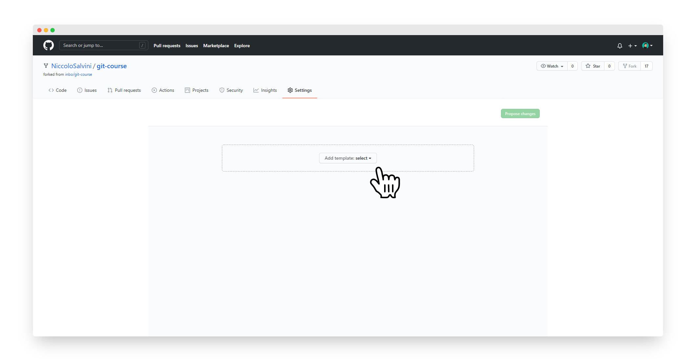
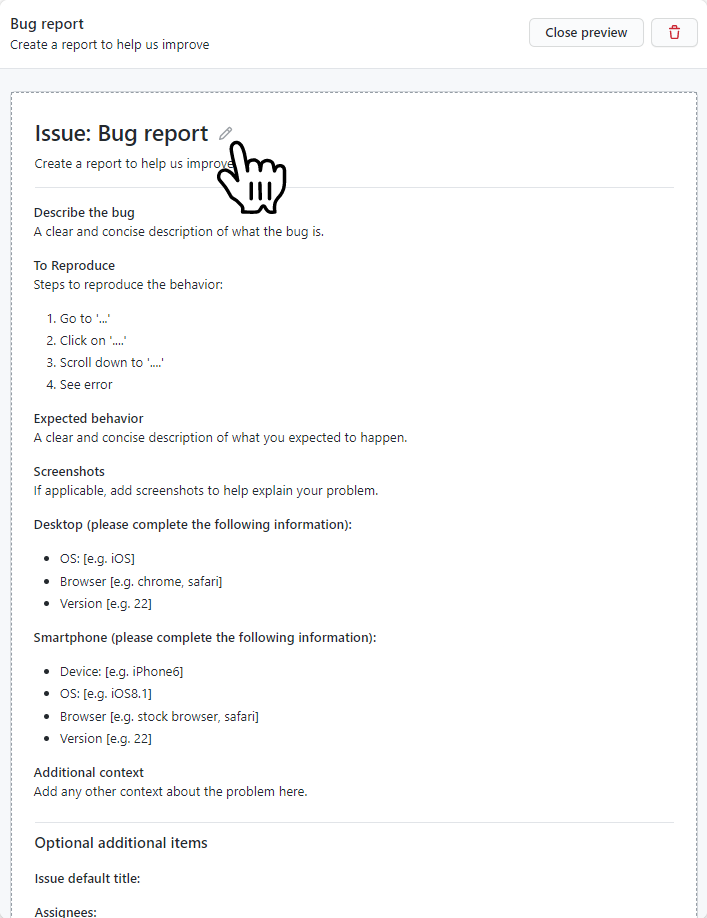

```{r setup, include=FALSE}
knitr::opts_chunk$set(echo = TRUE)

library(reprex, warn.conflicts = F, quietly = T)

```

## `issues` templates

Spesso è difficile risolvere un problema quando i dettagli importanti mancano o non sono ben evidenziati. Da febbario 2016 i manutentori/propietari di repo possono aggiungere dei templates prestabiliti ai loro loro progetti per `Issues` e `Pull Requests`. Facendo questo aiutano i contributori e collaboratori a condividere i dettagli necessari a cominciare una discussione.

Per aggiungere un template ad una repo è necessario creare un file `ISSUE_TEMPLATE` nella root dir. L'estesione del file è opzionale ma la buona pratica vuole che sia `.md` (è possibile avere una preview cliccandoci sopra come accade in automatico col `README.md`). L'estensione `.md`rende facile l'aggiunta di elementi come paragrafi, links, e menzioni a collaboratori, proprio come liste TODOs per i templates.

I templates per `Pull Requests` seguono lo stesso modello: aggiungi un file nominato `PULL_REQUEST_TEMPLATE` al root della tua repo.

Altrimenti procedi per `Settings > Features > Issues > Set up templates` (**scelta dell'autore**).

Se sei preoccupato del disordine nella root allora il consiglio è creare una dir `.github/` dove spostare `CONTRIBUTING.md`, `ISSUE_TEMPLATE.md`, and `PULL_REQUEST_TEMPLATE.md`. GitHub si occupererà si recuperare i files e tutto funzionerà esattamente alla stessa maniera.

Se vuoi approfondire oltre questo [ecco la documentazione](https://docs.github.com/en/communities/setting-up-your-project-for-healthy-contributions).

## Creazione Templates

Nel reindirizzamento dopo aver cliccato su `Set up templates` appare un'opzione centrale "Add Template" con un drop down menu. 


{width=75%}
---

Le tre default options proposte, per il momento sufficienti, sono:

- Bug Report
- Feature request
- Custom Template

Selezionando **Bug Report** automaticamente viene aggiunto una piccola tab con due tasti: "Preview and edit" e un cestino. Cliccando sul primo otteniamo:


---

La icona accanto al titolo Bug report segnalata dalla mano permette di modificare il template in tutte le sue parti:

- **Template name**: permettendoci di flettere il template a poter accogliere qualsiasi tipo di richiesta dell utente
- **About**: una piccola descrizione di quello che è il template name 
- **Template content**: il più importante, permette di editare il contenuto del template con sintassi Markdown.

Altre caratteristiche addizionali:

- **Issue Default Title**: solitamente un acronimo o una parola corta che precederà il titolo, di modo che in situazioni con tanti templates e con tante issues sarà possibile  ricollegare subito la issue alla fattispecie di problema e stabilire priorità.
- **Assignees**: permette di assegnare collaboratori a determinate issues, compartimenta il lavoro e lo specializza.
- altre..

Sotto sono stati riadattati due templates dall'autore per le azioni di **Bug Report** e di **Pull Request**. Niente vieta che tu possa scrivere le tue e formattarle come meglio credi sulle base delle esigenze che tu hai, per tutto il resto metto le mie. Sono aspecifiche e atematiche. E' sufficiente copiarle ed incollarle nel **Template content**.


### Bug Report temp:

    # Prerequisites

    Please answer the following questions for yourself before submitting an issue. **YOU MAY DELETE THE PREREQUISITES SECTION.**

    - [ ] I am running the latest version
    - [ ] I checked the documentation and found no answer
    - [ ] I checked to make sure that this issue has not already been filed
    - [ ] I'm reporting the issue to the correct repository (for multi-repository projects)

    # Expected Behavior

    Please describe the behavior you are expecting

    # Current Behavior

    What is the current behavior?

    # Failure Information (for bugs)

    Please help provide information about the failure if this is a bug. If it is not a bug, please remove the rest of this template.

    ## Steps to Reproduce

    Please provide detailed steps for reproducing the issue.

    1. step 1
    2. step 2
    3. you get it...

    ## Context

    Please provide any relevant information about your setup. This is important in case the issue is not reproducible except for under certain conditions.

    * Firmware Version:
    * Operating System:
    * SDK version:
    * Toolchain version:

    ## Failure Logs

    Please include any relevant log snippets or files here.
---

### Pull Request temp:
    
    ### All Submissions:
    
    * [ ] Have you followed the guidelines in our Contributing document?
    * [ ] Have you checked to ensure there aren't other open [Pull Requests](../../../pulls) for the same update/change?
    
    <!-- You can erase any parts of this template not applicable to your Pull Request. -->
    
    ### New Feature Submissions:
    
    1. [ ] Does your submission pass tests?
    2. [ ] Have you lint your code locally prior to submission?
    
    ### Changes to Core Features:
    
    * [ ] Have you added an explanation of what your changes do and why you'd like us to include them?
    * [ ] Have you written new tests for your core changes, as applicable?
    * [ ] Have you successfully ran tests with your changes locally?

---


Fatto questo naviga dinuovo verso la tua cartella e apri l' `issue` pane. Adesso è comparso il template del `bug report`.